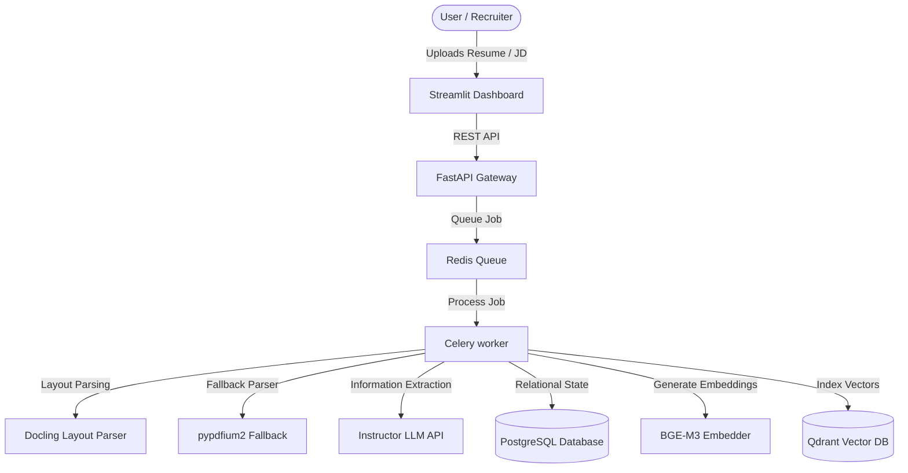

# 🎯 NexusMatch Engine

An enterprise-grade talent matching engine implementing asynchronous ingestion pipelines, dual dense-sparse vector hybrid searches, LightGBM LambdaMART machine learning rankings, TreeExplainer SHAP explainability, and fact-validated listwise LLM reranking.

---

## 🏗️ Architecture



---

## 🛠️ Tech Stack

- **Backend**: FastAPI, Celery, Redis
- **Storage**: PostgreSQL (SQLAlchemy ORM), Qdrant Vector Store
- **Parsing**: Docling, pypdfium2
- **Embeddings**: BGE-M3 (FlagEmbedding)
- **Machine Learning**: LightGBM (LambdaMART), SHAP (TreeExplainer)
- **LLM Refinement**: Instructor, OpenAI / vLLM
- **Frontend**: Streamlit Dashboard

---

## ⚡ Key Features

- **Layout-Aware parsing**: Preserves tables, headers, and structural layouts using Docling.
- **Hybrid Search**: Fuses dense semantic scores and sparse lexical scores in Qdrant collections using Reciprocal Rank Fusion (RRF).
- **ML LTR Ranker**: Evaluates candidates against 14 normalized features using a LightGBM LambdaMART ranker.
- **TreeExplainer SHAP**: Explains ML margins and local/global feature weights.
- **Fact Verification**: Deterministically validates LLM rationale strings against database raw resume texts.

---

## ⚙️ Running Locally

1. **Clone & Setup**:
   ```bash
   pip install -r requirements.txt
   ```
2. **Train Model**:
   ```bash
   python src/member3_ranking/train_ltr.py
   ```
3. **Run API Server**:
   ```bash
   uvicorn src.member4_orchestration.main:app --reload
   ```
4. **Launch Streamlit Dashboard**:
   ```bash
   streamlit run src/member4_orchestration/app_ui.py
   ```
