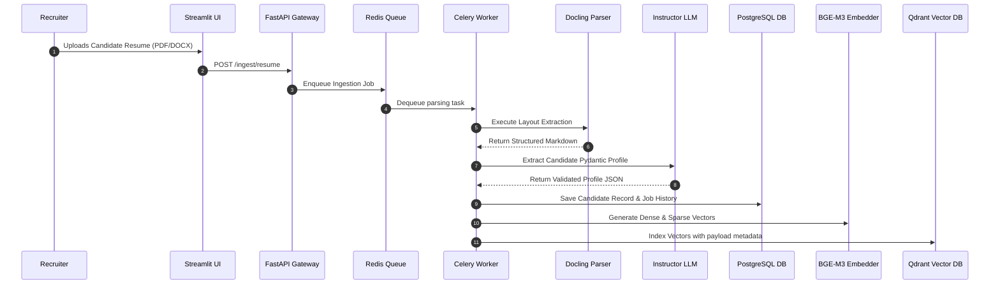

# Data Flow Diagram

```mermaid
sequenceDiagram
    autonumber
    Recruiter->>Streamlit UI: Uploads Candidate Resume (PDF/DOCX)
    Streamlit UI->>FastAPI Gateway: POST /ingest/resume
    FastAPI Gateway->>Redis Queue: Enqueue Ingestion Job
    Redis Queue->>Celery Worker: Dequeue parsing task
    Celery Worker->>Docling Parser: Execute Layout Extraction
    Docling Parser-->>Celery Worker: Return Structured Markdown
    Celery Worker->>Instructor LLM: Extract Candidate Pydantic Profile
    Instructor LLM-->>Celery Worker: Return Validated Profile JSON
    Celery Worker->>PostgreSQL DB: Save Candidate Record & Job History
    Celery Worker->>BGE-M3 Embedder: Generate Dense & Sparse Vectors
    Celery Worker->>Qdrant Vector DB: Index Vectors with payload metadata
```
