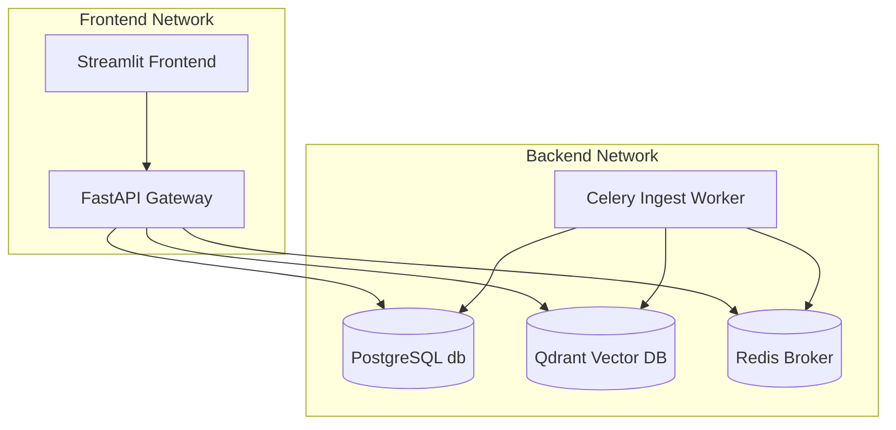

# Docker Services & Network Layout

```mermaid
graph TD
    subgraph Frontend Network
        ui[Streamlit Frontend] --> api[FastAPI Gateway]
    end
    
    subgraph Backend Network
        api --> db[(PostgreSQL db)]
        api --> qdrant[(Qdrant Vector DB)]
        api --> redis[(Redis Broker)]
        worker[Celery Ingest Worker] --> redis
        worker --> db
        worker --> qdrant
    end
```
