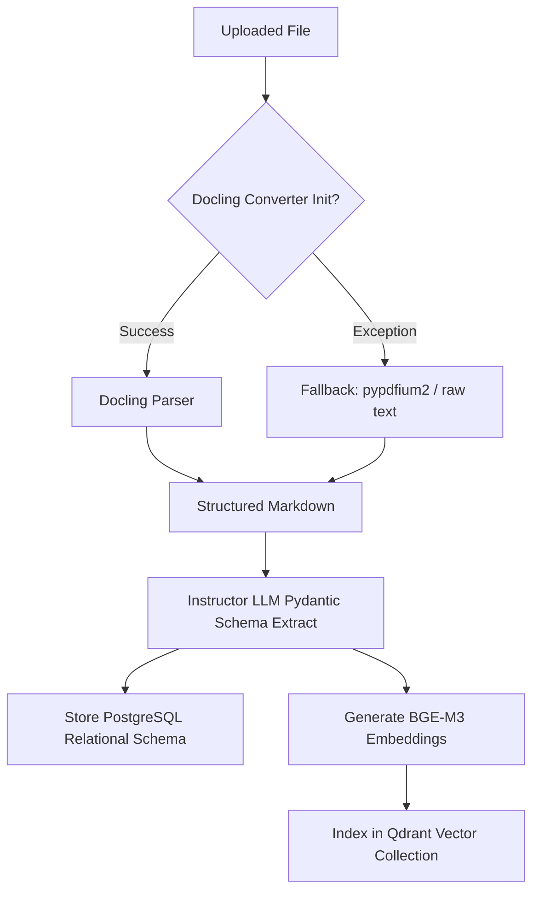

# Resume Ingestion Pipeline Flow

```mermaid
graph TD
    File[Uploaded File] --> CheckDocling{Docling Converter Init?}
    CheckDocling -->|Success| DoclingConvert[Docling Parser]
    CheckDocling -->|Exception| FallbackParser[Fallback: pypdfium2 / raw text]
    DoclingConvert --> StructMD[Structured Markdown]
    FallbackParser --> StructMD
    StructMD --> PydanticExtract[Instructor LLM Pydantic Schema Extract]
    PydanticExtract --> DBState[Store PostgreSQL Relational Schema]
    PydanticExtract --> EmbedVectors[Generate BGE-M3 Embeddings]
    EmbedVectors --> VectorDB[Index in Qdrant Vector Collection]
```
