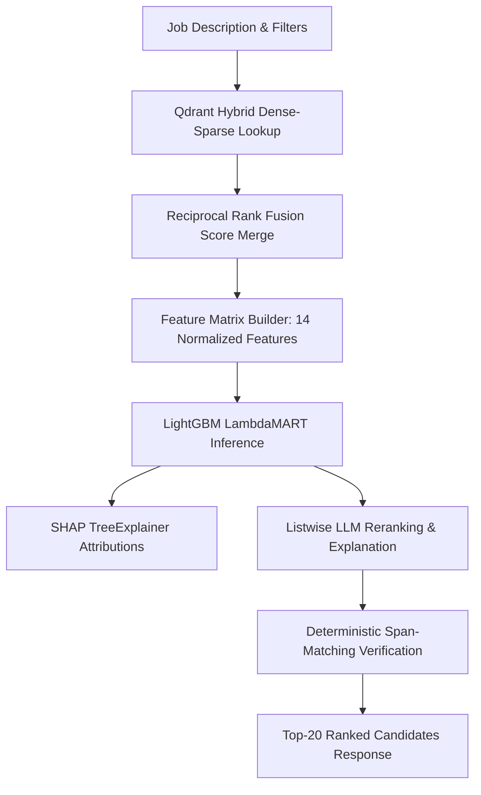

# Machine Learning & Reranking Flow

```mermaid
graph TD
    Query[Job Description & Filters] --> Qdrant[Qdrant Hybrid Dense-Sparse Lookup]
    Qdrant --> RRF[Reciprocal Rank Fusion Score Merge]
    RRF --> Features[Feature Matrix Builder: 14 Normalized Features]
    Features --> LGBM[LightGBM LambdaMART Inference]
    LGBM --> SHAP[SHAP TreeExplainer Attributions]
    LGBM --> LLM[Listwise LLM Reranking & Explanation]
    LLM --> FactCheck[Deterministic Span-Matching Verification]
    FactCheck --> FinalOutput[Top-20 Ranked Candidates Response]
```
