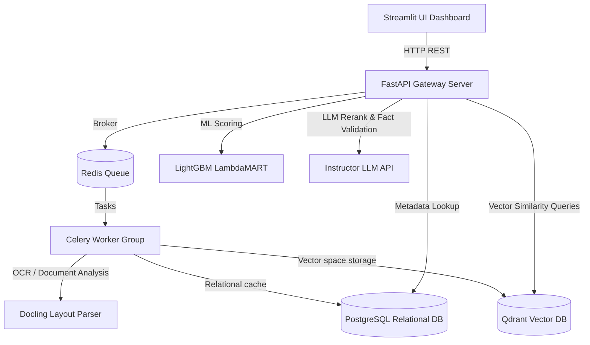

# System Architecture Diagram

```mermaid
graph TD
    UI[Streamlit UI Dashboard] -->|HTTP REST| API[FastAPI Gateway Server]
    API -->|Broker| Redis[(Redis Queue)]
    Redis -->|Tasks| Worker[Celery Worker Group]
    Worker -->|OCR / Document Analysis| Docling[Docling Layout Parser]
    Worker -->|Relational cache| DB[(PostgreSQL Relational DB)]
    Worker -->|Vector space storage| Qdrant[(Qdrant Vector DB)]
    API -->|Metadata Lookup| DB
    API -->|Vector Similarity Queries| Qdrant
    API -->|ML Scoring| LGBM[LightGBM LambdaMART]
    API -->|LLM Rerank & Fact Validation| LLM[Instructor LLM API]
```
